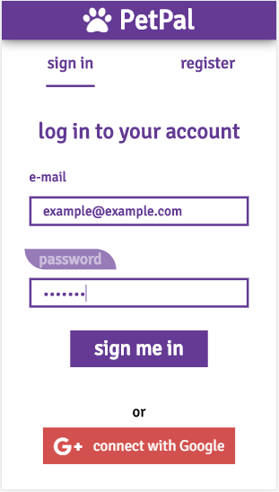

 # :cat: :dog: :mouse: :koala: :pig: :wolf: :baby_chick: :penguin: :fish: :hamster: :chicken: :octopus: :rabbit: :bird:

   

# PetPal
FedEx Project | Hackhaton Project 

Contributors: 
[bleaksmile](https://github.com/bleaksmile) | [ChrisFrill](https://github.com/chrisfrill) | [danizsin](https://github.com/danizsin) | [lyancsie](https://github.com/lyancsie) | [pitner33](https://github.com/pitner33) | [refike](https://github.com/refike) 

Project: PetPal is an application for wannabe-owners to make connection with shelters and private users to adopt different kinds of pets.

Technologies used:
 
| React | Redux | HTML5 | SCSS | SAGA |
 
| Dart  | BLoC | Flutter |
 
| Java | Spring Boot | JPA | Hibernate | 
 
| MySQL | Flyway | Oauth2 | Spring Security | 
 
| Git | Heroku | Reflection API | Google API |
 
| JUnit | MockMVC | Mockito | CircleCI |

Environment variables 

| Key | Value |
| --- | ----- | 
|DATASOURCE_URL | jdbc:mysql://localhost/yourDBname |
|DATASOURCE_USERNAME | *your local mysql username* |
|DATASOURCE_PASSWORD | *your local mysql password* |
|HIBERNATE_DIALECT | org.hibernate.dialect.MySQL57Dialect|
|PETPAL_TOKEN_SIGNING_KEY | *a signing key specified by you* |
|HOME_URL | https://petpalgf.herokuapp.com/googleauth |
|GOOGLE_API_KEY | *provided only for dedicated users* |
|GOOGLE_CLIENTID | 22573920447-06l4jrtm9u1poo486qfdqi1n7cbj5mht.apps.googleusercontent.com |
|GOOGLE_CLIENTSECRET | 6E1iTJo_X303wlqXMYGCPe1c |
|GOOGLE_REDIRECT | https://petpalgf.herokuapp.com//oauth2/callback/google |

_________________________________________________________________

 
# [Mobile App](https://github.com/ChrisFrill/petpal)
 
Pet Finder
 

 
Chat
 

 
Pet Finder
 

